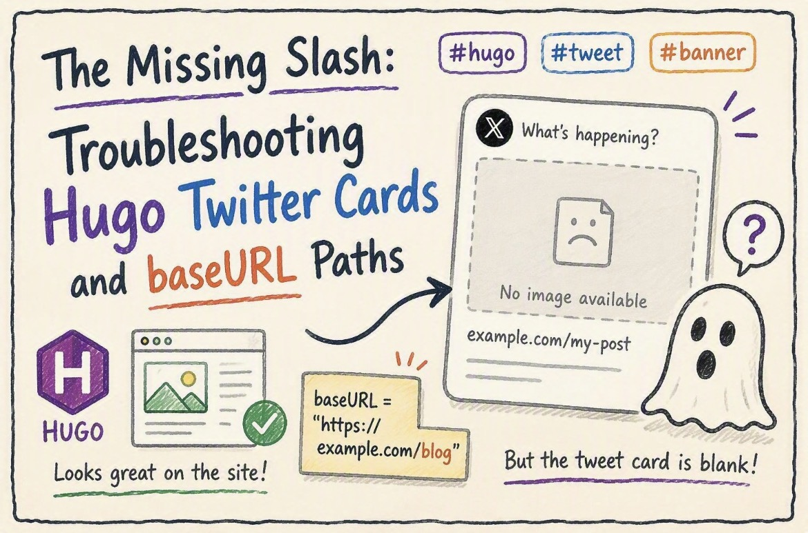

+++
date = '2026-08-27T05:57:00-04:00'
draft = false
title = 'The Missing Slash: Troubleshooting Hugo Twitter Cards and baseURL Paths'
tags = ['hugo', 'tweet card', 'slash', 'banner']

[params.cover]
  image = "banner.jpeg"
  alt = "hugo baseURL missing slash"
  relative = true
+++

I recently finalized a pretty neat automation for my static blog. I built a custom Gemini skill that takes my Obsidian drafts and automatically generates wobbly, hand-drawn-style cover banners and spot illustrations. The workflow is entirely frictionless: I write in Obsidian, sync via the iOS Git plugin, and GitHub Actions takes over to build the Hugo site.

The pipeline worked flawlessly—until I tried to share the latest post on X (Twitter).

## The Ghost Banner

The GitHub Action passed. The site was live, and the banner image loaded perfectly on the actual webpage. But when I pasted the link into a tweet draft, the social preview card was completely blank.

My setup uses the Hugo PaperMod theme with page bundles, meaning the image file sits in the exact same folder as the markdown file. In the front matter, it looks like this:

```
[params.cover]
      image = "banner.jpeg"
      alt = "How to create blogging visual skill"
      relative = true
```

Since this exact configuration works perfectly on my other Hugo repository, I knew the issue wasn't the front matter itself.

## Investigating the Crawler Logs

I ran the URL through the X Card Validator. The logs returned something interesting:
```
INFO: Page fetched successfully
INFO: twitter:card = summary_large_image tag found
INFO: Card loaded successfully
```

What was missing? There was no line confirming the image URL was found. The crawler was reading the metadata but completely dropping the image.

## The Culprit: Hugo's baseURL Trailing Slash

The root cause came down to a single character in my global configuration. In my hugo.toml file, I had defined the repository URL like this:

```
baseURL = "https://robertluwang.github.io/life"
```

Notice what is missing? The trailing slash.

Because Hugo is built on Go, it follows strict web protocol path resolution. When you set relative = true, Hugo attempts to construct the absolute Open Graph URL (og:image) by appending your local image path to the baseURL.

Without the trailing slash, Go treats /life as a file endpoint rather than a base directory. When it concatenates the image path, it strips the "file" out entirely. This resulted in Hugo outputting a broken, nonexistent absolute URL in the metadata header, completely skipping the sub-directory. Social crawlers require a strict, absolute URL. They hit a 404 error and failed silently.

## Why the Pipeline Didn't Catch It

It is easy to get a false sense of security when the CI/CD pipeline gives you a green checkmark.

GitHub Actions: The hugo --minify command merely compiles files. It does not validate external link resolution. It compiled without syntax errors and exited with code 0.

Web Browsers: Browsers use DOM-relative paths (e.g., ). Because the HTML and the image sit in the same folder on the live server, the browser resolves the local path natively, ignoring the broken Open Graph metadata completely.

## The Fix and the Cache Trap

The technical fix was trivial: change the configuration to baseURL = "https://robertluwang.github.io/life/"

However, X's caching is notoriously aggressive. Simply pushing the fix wasn't enough, because Twitter had already locked in the broken preview for that specific URL. Rather than messing around with URL query strings to bust the cache, I took the nuclear option. I completely deleted the broken post folder, created a brand new one with a slightly altered title, and copied all the markdown and images over.

By forcing a completely new URL, X was forced to scrape the fresh metadata, and the wobbly banner finally appeared. A frustrating hour of debugging, but a necessary reminder: in static site generation, every slash matters.
